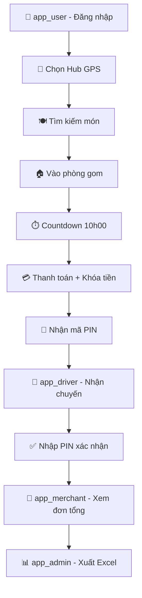

# ✅ Walkthrough - Dự án GomĐơn Đã Hoàn Thành

## Tổng Quan
Đã tạo thành công **38 file** trong thư mục `gom_don_project/` với đầy đủ 5 module.

---

## Cây Thư Mục Hoàn Chỉnh

```
gom_don_project/
│
├── shared/                          ← Thư viện dùng chung (ƯU TIÊN SỐ 1)
│   ├── lib/
│   │   ├── models/
│   │   │   ├── user_model.dart      ← Khách hàng + ví tiền
│   │   │   ├── hub_model.dart       ← Điểm giao hàng + tọa độ
│   │   │   ├── room_model.dart      ← Phòng gom đơn
│   │   │   ├── merchant_model.dart  ← Quán ăn + FoodItem
│   │   │   └── order_model.dart     ← Đơn hàng + OrderItem
│   │   └── services/
│   │       └── firebase_core.dart   ← Khởi tạo Firebase
│   ├── test/
│   │   └── mock_data.dart           ← 🧪 DỮ LIỆU KIỂM THỬ ĐẦY ĐỦ
│   └── pubspec.yaml
│
├── app_user/                        ← [DEV A] Khách hàng
│   ├── lib/
│   │   ├── main.dart
│   │   └── src/
│   │       ├── core/
│   │       │   ├── app_colors.dart       ← Hệ thống màu sắc
│   │       │   ├── app_routes.dart       ← Điều hướng
│   │       │   └── utils/time_helper.dart ← ⏱ Logic 10h00
│   │       └── features/
│   │           ├── auth/                 ← Đăng nhập
│   │           ├── location_hub/         ← GPS + Chọn Hub
│   │           ├── search_food/          ← Tìm kiếm quán
│   │           ├── room_group/           ← Phòng gom + Countdown
│   │           └── checkout/             ← Thanh toán + Tạm khóa tiền
│   └── pubspec.yaml
│
├── app_driver/                      ← [DEV B] Tài xế
│   ├── lib/
│   │   ├── main.dart
│   │   └── src/features/
│   │       ├── pooling/              ← Danh sách chuyến + Nhận chuyến
│   │       └── delivery/             ← Xác nhận PIN/QR
│   └── pubspec.yaml
│
├── app_merchant/                    ← [DEV B] Chủ quán
│   ├── lib/
│   │   ├── main.dart
│   │   └── features/bulk_order/     ← Đơn tổng bếp
│   └── pubspec.yaml
│
└── app_admin/                       ← [DEV B] Quản trị
    ├── lib/
    │   ├── main.dart
    │   └── features/
    │       ├── hub_management/       ← Thêm/sửa Hub
    │       └── financial_reconciliation/ ← Xuất Excel
    └── pubspec.yaml
```

---

## Dữ Liệu Kiểm Thử (`shared/test/mock_data.dart`)

| Bộ Dữ Liệu | Nội Dung | Phục Vụ Test |
|------------|---------|--------------|
| `mockHubs` (3) | Viettel CT, CoopMart Hưng Lợi, FPT CT | Test GPS định vị Hub |
| `mockUsers` (4) | An(ví 500k), Bích(320k), Châu(800k), Dũng(ví ngắt) | Test mọi trạng thái ví |
| `mockMerchants` (3) | Cơm Tấm Bà Ba, Bún Bò Cô Hạnh, Cháo Ếch Tám Liên | Test tìm kiếm & filter |
| `mockRooms` (2) | PHONG001(đang gom), PHONG002(thành công+tài xế) | Test cả 2 trạng thái |
| `mockOrders` (5) | Chờ chốt×2, Thành công×1, Đã giao×1, Đã hủy×1 | Test đủ mọi flow |

### Tài Khoản Test Nhanh
```
Số ĐT: 0901234567 / Mật khẩu: 123456
→ Nguyễn Văn An | Ví: 500,000đ (connected) | Hub: Viettel
```

---

## Luồng Kiểm Thử Gợi Ý



---

## Bước Tiếp Theo Để Chạy Được App

### 1. Cài Flutter packages (mỗi thư mục)
```bash
cd gom_don_project/shared && flutter pub get
cd ../app_user && flutter pub get
cd ../app_driver && flutter pub get
cd ../app_merchant && flutter pub get
cd ../app_admin && flutter pub get
```

### 2. Tích hợp Firebase (sau khi test mock xong)
- Tạo project Firebase Console
- Thêm file `google-services.json` vào `android/app/` của mỗi phân hệ
- Thay `// TODO` trong các controller bằng Firestore calls thật

### 3. Thêm Google Maps API Key (cho app_user)
- Thêm vào `android/app/src/main/AndroidManifest.xml`

> [!TIP]
> Hiện tại tất cả controller đều dùng **Mock Data** - có thể chạy test **không cần Firebase thật**. Chỉ cần tích hợp Firebase khi đã confirm logic đúng!
