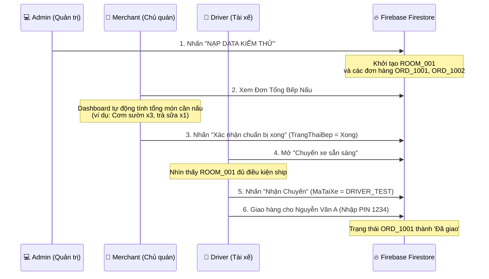

# 📋 Walkthrough: Hoàn Thành Kết Nối Giao Diện 3 Phân Hệ (Admin, Driver, Merchant)

> Dự án: **GomĐơn** — Flutter + Firebase | Vai trò: **Thành viên B** (app_admin, app_driver, app_merchant)

Chúng tôi đã tiến hành liên kết hoàn chỉnh mã nguồn giao diện (UI) thực tế thay thế cho các màn hình chờ (Placeholders) và sửa lỗi điều hướng trên cả 3 ứng dụng con của bạn:

---

## 🛠️ Các cập nhật hệ thống giao diện

### 1. Phân hệ Admin (`app_admin`)
* **File cập nhật**: [app_admin/lib/main.dart](file:///d:/N%C4%83m%203/HKIII/CT220H_L%E1%BA%ADp%20tr%C3%ACnh%20n%E1%BB%81n%20t%E1%BA%A3ng%20%C4%91a%20di%20%C4%91%E1%BB%99ng/GOM%20DON%20PROJECT/gom_don_project/app_admin/lib/main.dart)
  * Đã import và đăng ký định tuyến (`routes`) đầy đủ cho hai màn hình nghiệp vụ thực tế là **Quản lý Hub** ([HubManagementScreen](file:///d:/N%C4%83m%203/HKIII/CT220H_L%E1%BA%ADp%20tr%C3%ACnh%20n%E1%BB%81n%20t%E1%BA%A3ng%20%C4%91a%20di%20%C4%91%E1%BB%99ng/GOM%20DON%20PROJECT/gom_don_project/app_admin/lib/features/hub_management/hub_management_screen.dart)) và **Đối soát tài chính** ([ReconciliationScreen](file:///d:/N%C4%83m%203/HKIII/CT220H_L%E1%BA%ADp%20tr%C3%ACnh%20n%E1%BB%81n%20t%E1%BA%A3ng%20%C4%91a%20di%20%C4%91%E1%BB%99ng/GOM%20DON%20PROJECT/gom_don_project/app_admin/lib/features/financial_reconciliation/reconciliation_screen.dart)).
  * Sửa lỗi crash điều hướng `pushNamed` trước đó.

### 2. Phân hệ Chủ quán (`app_merchant`)
* **File cập nhật**: [app_merchant/lib/main.dart](file:///d:/N%C4%83m%203/HKIII/CT220H_L%E1%BA%ADp%20tr%C3%ACnh%20n%E1%BB%81n%20t%E1%BA%A3ng%20%C4%91a%20di%20%C4%91%E1%BB%99ng/GOM%20DON%20PROJECT/gom_don_project/app_merchant/lib/main.dart)
  * Loại bỏ `_KitchenPlaceholder` cũ.
  * Liên kết nút bấm "Xem đơn tổng bếp nấu" đi thẳng tới màn hình [KitchenDashboardScreen](file:///d:/N%C4%83m%203/HKIII/CT220H_L%E1%BA%ADp%20tr%C3%ACnh%20n%E1%BB%81n%20t%E1%BA%A3ng%20%C4%91a%20di%20%C4%91%E1%BB%99ng/GOM%20DON%20PROJECT/gom_don_project/app_merchant/lib/features/bulk_order/kitchen_dashboard_screen.dart).

### 3. Phân hệ Tài xế (`app_driver`)
* **File cập nhật**: [app_driver/lib/main.dart](file:///d:/N%C4%83m%203/HKIII/CT220H_L%E1%BA%ADp%20tr%C3%ACnh%20n%E1%BB%81n%20t%E1%BA%A3ng%20%C4%91a%20di%20%C4%91%E1%BB%99ng/GOM%20DON%20PROJECT/gom_don_project/app_driver/lib/main.dart)
  * Đã được liên kết trực tiếp và làm đẹp giao diện từ trước, kết nối trực tiếp đến [TripPoolScreen](file:///d:/N%C4%83m%203/HKIII/CT220H_L%E1%BA%ADp%20tr%C3%ACnh%20n%E1%BB%81n%20t%E1%BA%A3ng%20%C4%91a%20di%20%C4%91%E1%BB%99ng/GOM%20DON%20PROJECT/gom_don_project/app_driver/lib/src/features/pooling/trip_pool_screen.dart) và [VerificationScreen](file:///d:/N%C4%83m%203/HKIII/CT220H_L%E1%BA%ADp%20tr%C3%ACnh%20n%E1%BB%81n%20t%E1%BA%A3ng%20%C4%91a%20di%20%C4%91%E1%BB%99ng/GOM%20DON%20PROJECT/gom_don_project/app_driver/lib/src/features/delivery/verification_screen.dart).

---

## 🧭 Kịch Bản Kiểm Thử Liên Hoàn (End-to-End Test Scenario)

Khi chạy 3 ứng dụng trên máy ảo, bạn có thể thực hiện kiểm thử trơn tru toàn bộ luồng như sau:

### Chi tiết các bước:
1. **Admin App**:
   * Khởi động `app_admin`.
   * Nhấn **NẠP DATA KIỂM THỬ (DEV B)** → Dữ liệu ảo của `ROOM_001` và các đơn hàng con được đẩy lên Firebase.
   * Thử vào **Quản lý Hub cố định** và **Đối soát tài chính Excel** để kiểm tra giao diện làm việc thật của Admin.
2. **Merchant App**:
   * Khởi động `app_merchant`.
   * Nhấn **Xem đơn tổng bếp nấu**. Bạn sẽ thấy giao diện bếp tổng hợp.
   * Dropdown trên cùng hiển thị `ROOM_001`. Món ăn được tự động tính tổng: *Cơm sườn trứng x2, Trà sữa trân châu x1...* cùng danh sách ghi chú đặc biệt ("Nhiều mỡ hành", "70% đường").
   * Nhấn **Xác nhận chuẩn bị xong → Gọi tài xế**.
3. **Driver App**:
   * Khởi động `app_driver`.
   * Vào **Danh sách chuyến xe (Chờ nhận)** → Nhấn **Nhận Chuyến Xe Này** đối với `ROOM_001`.
   * Chọn **Giao ngay** trên pop-up → Giao diện hiển thị 2 đơn hàng cần giao của Nguyễn Văn A và Trần Thị B.
   * Tiến hành nhập mã PIN (`1234` hoặc `5678`) hoặc quét mã QR giả lập để hoàn tất giao hàng.
